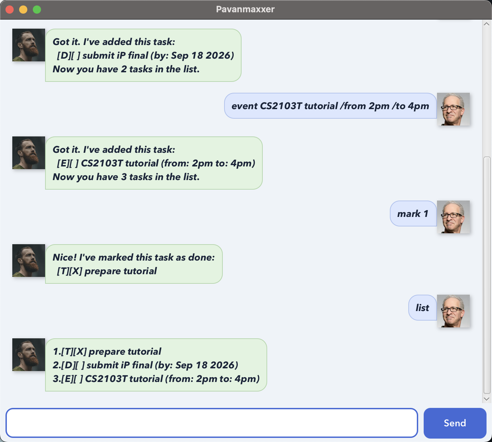

# Pavanmaxxer User Guide

Pavanmaxxer is a desktop task manager that lets you manage todos, deadlines,
and events using short commands. Your tasks are saved automatically, so they
remain available the next time you start the application.



## Quick start

1. Install Java 25.
2. Download `pavanmaxxer.jar` from the latest GitHub release.
3. Place the JAR in an empty folder.
4. Open a terminal in that folder.
5. Run `java -jar pavanmaxxer.jar`.
6. Enter commands in the text field and press **Enter** or click **Send**.

Command words and parameter markers are case-sensitive. Replace words written
in uppercase below with your own values; do not type the square brackets.

## Understanding the task list

Pavanmaxxer uses these task labels:

- `[T]` — todo
- `[D]` — deadline
- `[E]` — event
- `[ ]` — incomplete task
- `[X]` — completed task

Task numbers are shown by the `list` and `find` commands. Use those numbers
with `mark`, `unmark`, and `delete`.

## Viewing all tasks

Format: `list`

Example:

```text
list
```

Pavanmaxxer displays every task in its saved order. If there are no tasks, it
responds with `Your task list is empty.`

## Adding a todo

Format: `todo DESCRIPTION`

Example:

```text
todo read chapter 6
```

Expected result:

```text
Got it. I've added this task:
  [T][ ] read chapter 6
Now you have 1 task in the list.
```

## Adding a deadline

Format: `deadline DESCRIPTION /by yyyy-MM-dd`

Example:

```text
deadline submit report /by 2026-09-18
```

Deadline dates must be real calendar dates in `yyyy-MM-dd` format.

Expected result:

```text
Got it. I've added this task:
  [D][ ] submit report (by: Sep 18 2026)
Now you have 2 tasks in the list.
```

## Adding an event

Format: `event DESCRIPTION /from START /to END`

Example:

```text
event tutorial /from 2pm /to 4pm
```

The `/from` field must appear before `/to`, and both values must be present.

Expected result:

```text
Got it. I've added this task:
  [E][ ] tutorial (from: 2pm to: 4pm)
Now you have 3 tasks in the list.
```

## Marking a task as complete

Format: `mark TASK_NUMBER`

Example:

```text
mark 2
```

The selected task changes from `[ ]` to `[X]`.

## Marking a task as incomplete

Format: `unmark TASK_NUMBER`

Example:

```text
unmark 2
```

The selected task changes from `[X]` to `[ ]`.

## Deleting a task

Format: `delete TASK_NUMBER`

Example:

```text
delete 1
```

Pavanmaxxer removes the selected task and reports the number of remaining
tasks.

## Finding tasks

Format: `find KEYWORD [MORE_KEYWORDS]`

Examples:

```text
find book
find submit report
```

Search is case-insensitive. When multiple keywords are supplied, a task must
contain every keyword in its description. If there are no matches,
Pavanmaxxer reports the searched text instead of showing an empty result.

## Duplicate tasks

Pavanmaxxer treats tasks as duplicates when their type and details match,
ignoring letter case and completion status. Deadline dates and event time
values are part of the comparison.

A duplicate is still added and saved because repeated tasks can be
intentional. Pavanmaxxer warns you first:

```text
This task already exists in your list, but I've added it again:
  [T][ ] READ CHAPTER 6
Now you have 4 tasks in the list.
```

## Exiting

Format: `bye`

Pavanmaxxer shows a farewell message and closes the application.

## Saving and loading

Changes are saved automatically in `data/pavanmaxxer.txt`, relative to the
folder from which the application was started. Do not edit this file while
Pavanmaxxer is running. If the file is missing, Pavanmaxxer creates a new one.

## Common errors

- A task description cannot be empty.
- Deadline dates must use `yyyy-MM-dd` and must represent a real date.
- A deadline must contain exactly one `/by` field.
- An event must contain exactly one `/from` field and one `/to` field, in that
  order.
- Task numbers must be integers that currently exist in the list.
- Task details cannot contain the `|` character because it is reserved by the
  saved-data format.
- Unknown commands produce an error without changing or saving the task list.
